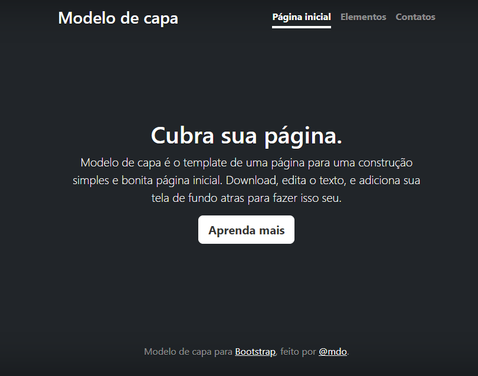

# Indice

[Projeto de portfólio pessoal](#projeto-de-portf%C3%B3lio-pessoal)  
[Descriçãp](#descri%C3%A7a%C3%B5)  
[Funcionalidades](#introdu%C3%A7%C3%A3o)  
[Tecnologias utilizadas](#funcionalidades)  
[Fontes consultadas](#fontes-consultadas)  
[Autores](#autores)  

# Projeto de portfólio pessoal  

Projeto criado utilizando exemplo de bootstrap para ensino de uso do README e do Bootstrap.

##   Descrição 

O propósito deste projeto, o objetivo, foi aprimorar as habilidades relacionadas à construção de texto que compõe o README.

##   Introdução

Projeto de capa pego para ser usado no treinamento sobre a escrita de README.

##   Funcionalidades

As funçãos não vão nada além da capa do site para aprender mais sobre o README.

### Tecnologias utilizadas

Foram utilizados neste projeto Bootstrap, HTML e CSS

## Fontes consultadas

* [Alura](https://www.alura.com.br/artigos/escrever-bom-readme) - Como escrever um README incrível no seu Github
* [Alura](https://gist.github.com/lohhans/f8da0b147550df3f96914d3797e9fb89-) - Um modelo para fazer um bom README.md
* [Alura](https://getbootstrap.com/)
## Autores

Bryan Cardoso
